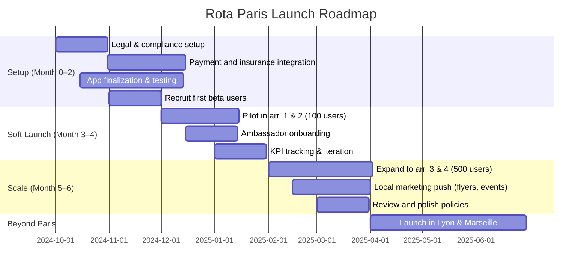

# Executive Summary  
Paris – as a global fashion capital – offers fertile ground for a luxury fashion rental marketplace.  With ~2.04 M residents (city) and 13.3 M in the metro area, there are large affluent and event-driven customer segments. A hybrid fulfillment model (local meet-ups *plus* optional tracked shipping) maximises convenience: **in-person pickup** leverages Paris’s density (free/local) while **delivery** extends reach.  The transaction flow should be end-to-end secure and friction-minimised: renters pay via a Stripe-powered escrow-like system, both parties use on‑phone QR scans and photos to document condition, and short inspection windows (e.g. 6–12 h) allow reporting issues.  Behind the scenes, Rota holds payments until return, releases funds post-inspection, and only charges for verified damage – all to preserve a premium “concierge” feel.  

**Key priorities:** user trust and seamless UX.  Show luxury-worth copy (e.g. *“Borrow your dream dress – delivered or picked up on your schedule. Secure payment & Rota Protection included.”*), and hide all deposit/insurance jargon behind a small “Rota Protection” detail page.  Track metrics (booking completion rate, dispute rate, user ratings) to tune conversions.  A phased Paris rollout – starting with a small pilot (100–200 users, 1–2 arrondissements) and carefully recruited ambassadors – ensures learnings before scaling.  Below we cover market context, fulfilment, flows, payments, legal/insurance, UX/copy suggestions, A/B tests, KPIs, and a launch roadmap.  

## 1. Paris Luxury Rental Context  
Paris is *the* global fashion hub, with major luxury brands (Louis Vuitton, Chanel, Hermès, etc.) headquartered there. Local consumers value style and sustainability: interest in “sharing economy” fashion is rising (especially among younger/high-earning Parisians). While exact rental-market stats in France are scarce, Western studies show growing demand – e.g. fashion rental was valued at several billion USD globally in 2023 and rapidly growing.  In Paris, target customers include *career women, socialites, event-goers, and fashion-conscious professionals* who prefer “renting” high-end outfits (occasion wear, work attire) over owning. Social factors (environmental awareness, low-commitment lifestyle) further drive this trend.  

Supporting data: Paris’s population (2.04M city; 13.3M metro) and its status as *“international fashion capital”* suggest high latent demand.  The city hosts Fashion Week (twice a year) and numerous galas, weddings and corporate events – occasions where customers might rent rather than buy.  Young Parisians are digitally connected (nearly all have smartphones), making app-based rental services viable.  In summary, Paris has a **large, style-conscious audience** willing to pay for luxury “access” at a discount, if the experience feels premium and safe.  

## 2. Hybrid Fulfilment Model (Hand-to-Hand + Shipping)  

| Option            | Pros                                  | Cons                                  |
|-------------------|---------------------------------------|---------------------------------------|
| **In-Person Handoff** (Paris meet-up) | • No shipping cost for user.   • Builds trust via face‑to‑face exchange.   • Immediate handoff confirmation (QR scan). | • Requires both parties to be in Paris; limits geography.  • Scheduling overhead (finding time/place).  • Potential safety/perception concerns (mitigated by public location). |
| **Shipping (Tracked)** | • Allows renters beyond immediate neighborhood (or out-of-town guests).   • Convenient door-to-door option (especially on arrival day). | • Additional cost (carrier + time).  • Slower (typically 2–5 days in France).  • Packaging and handling risk (wrinkles, lost/damaged in transit). |

*Table: Fulfilment options – hybrid approach leverages both.*  

**Recommendation:** Make **in-person pickup** the default in Paris (advertised as free/local), and **shipping** optional at a modest fee.  Paris’s compact area means many owners and renters can conveniently meet (e.g. at metro stops, cafés, landmarks).  This maximises conversion by avoiding shipping costs and the hassle of packaging.  For renters farther away or preferring not to meet, offer **carrier delivery with prepaid labels**.  

Implementation details: When listing an item, allow lenders to specify if they *prefer* handoff, or are open to shipping (they can select whether to ship only to Relay points or door).  On the borrower side, after selecting dates, show a toggle: “Meet in Paris (free)” vs “Delivery (€X)”.  Booking proceeds only once the borrower chooses one.  

## 3. Transaction Flow (Borrower & Lender)  

Below is a consolidated step-by-step flow.  Both renter (borrower) and owner (lender) go through coordinated stages. Emphasis is on clear UX with minimal visible friction.  

### Borrower (Renter) Side:  

1. **Search & Select Item:** Renter filters by date, item, size. Each listing shows *“In-Person (Free) / Delivery (€Y)”* options. Listing copy highlights luxury (e.g. *“Chanel Dress, retail €2900”*) and trust cues (“Payment protected by Rota” badge).  

2. **Booking & Payment:** Renter picks dates, chooses meet or ship, then enters payment. They see a summary: 
   > **Your Charge:** €X (includes rental fee + Rota fee + [delivery if any])  
   > *Payment secured by Stripe – Rota protection included.*  
   The renter submits payment via Stripe (connected). The lender is **not** paid yet.  

3. **Lender Acceptance:**  Owner is notified (push/email) and reviews the request. If acceptable, they **confirm**. If not, they can decline (rare if calendar updated). 

4. **Pre-Handoff Preparation:**  
   - **If Shipping:** Rota generates a prepaid tracking label and return label. The lender prints labels (e.g. PDF or visits a Relay), photographs the packed item, and drops it at the carrier/point. Rota shows real-time tracking to both parties.  
   - **If Meet:** The lender and renter coordinate time/place via Rota’s chat or phone. The lender prepares by doing a quick photo of the item in its current condition (through the app).

5. **Handoff – QR Confirmation:**  
   - At the agreed meeting, the lender selects “Ready to Handover” in Rota. Rota generates a one-time QR code on the lender’s phone. The renter scans it on *their* app. Upon scan, *both screens show “Item handed over ✅”*. The app automatically timestamps handoff.  
   - (If shipping) Once the item scans into the carrier network as “colis pris en charge”, Rota similarly marks it as “In transit → Received by courier.”  

6. **Use & Enjoy:** Renter wears the item. Rota timers count down the rental period. Automatic reminders (“Return deadline: tomorrow”) can be sent.  

7. **Return Step:** At rental end, renter initiates return:  
   - **Meet:** Renter suggests a return meeting (perhaps same spot). Similar QR scan process: lender scans renter’s QR, both confirm “Item returned”.  
   - **Ship:** Renter uses prepaid return label, drops at Relay/point. Tracking updates the status to “Returned in transit”, then “Delivered to owner”. Rota marks “Item delivered to owner”.  

8. **Borrower Inspection:** Immediately upon handoff/delivery, lender has X hours (e.g. 6–12h) to review condition. If no issues are reported by their “Inspection Timer” deadline, the item is considered accepted as returned.  

### Lender (Owner) Side:  

- **Listing Setup:** Owner creates a listing with description, retail value, multiple photos, sizes. They choose whether to allow shipping and set shipping fee if any (or leave at default small markup). They also set rental price and availability calendar.  

- **Post-Booking Acceptance:** When a booking request arrives, lender confirms. Rota informs them *“Payment secured – safe to proceed”*.  

- **Pre-Handover Photos:** Right before giving out the item, lender taps “Prepare Handoff” in-app, takes timestamped photos (front/back/labels) of garment condition. These are stored (encrypted) in Rota for later comparison.  

- **Handoff Scan:** Lender generates QR code for borrower to scan (see above). Once scanned, item is out of lender’s possession. The clock starts.  

- **Await Return:** Owner tracks shipping or awaits meet.  

- **Post-Return Inspection:** Upon renter’s return (QR scan or delivery confirmation), lender reviews the actual item. They can compare it to pre-handover photos. If no damage, lender taps “All Good – Complete Rental”. Rota then automatically releases payment and any deposits. If there is damage beyond normal wear, they upload photos via the app and note the issue. A small claim process starts (renter can respond).  

- **Finalize:** Once lender finalizes (good or with claim), the system processes payout to lender via Stripe, and both sides are asked for a review.

## 4. Payment Architecture (Escrow)  

Rota must securely handle money flows. We recommend using a **marketplace payment provider** (e.g. **Stripe Connect** in Europe) to act as an escrow-like intermediary. The flow:  

- **Renter pays up front** (rental fee + shipping + Rota’s commission). Stripe holds the funds in Rota’s Stripe account or a pooled account, and only transfers the owner’s share after successful return.  
- **Security deposit:** Instead of capturing a full deposit (which could hurt conversion), Rota can *authorize* a small refundable amount (or none) on the renter’s card. Alternatively, rely on Stripe’s “destination charges” split and post-authorize for damages only if needed.  
- **Release timing:** Upon completion, Rota triggers Stripe to transfer the owner’s earnings. If damage is claimed, Rota can capture the authorized hold (within 7 days) or charge the renter’s saved card for the damage fee.  
- **Refunding:** The deposit hold (if used) is released via Stripe’s refund API.  

**Option Comparison:**  

| Processor     | Features                           | Considerations                                   | Fees (approx)*        |
|---------------|------------------------------------|--------------------------------------------------|----------------------|
| **Stripe Connect** | Built-in marketplace split/pay; supports deferred payouts and holds; widely used in EU. | Requires KYC onboarding of owners (Stripe does it). Well-documented API. 7-day auth limits may need manual capture for >7-day rentals. | ~1.4%+€0.25 per txn (EU cards); ~2.9%+€0.25 (non-EU).   |
| **Lemonway**  | French PSP with marketplace focus, can escrow funds. | Longer integration time. French compliance-friendly. | ~1.0–1.5% + fixed per txn (quoted on request).  |
| **MangoPay**  | EU-licensed, supports marketplaces, pre-authorizations, IBAN wallet. | Geared to startups; UI less user-friendly. Requires license queries. | ~1.0% + €0.18.                         |
| **PayPal (Braintree)** | Easy user experience; branded trust. | No true escrow: funds transferred instantly to owner (bad). Might require holding in merchant account (complex). | ~2.9%+€0.30 typical.                 |
| **Négoce (Local)** | Hypothetical: hold funds in a French bank (Compte de tiers/consignations). | Not practical for a startup (notary or bank escrow needed by law). | –                 |

\*Fees are indicative and vary.  
 shows MondialRelay (context removed, ignore)

**Recommendation:** Use **Stripe Connect (Custom or Express accounts)**. It supports split payments and can delay paying out owners. Stripe’s verification will cover needed KYC for owners as “Sellers” on the platform. Rota’s commission is automatically deducted. For rentals longer than 7 days, Rota may need to manually capture any damage deposit via the Stripe API within the auth window, or implement a separate payment request at return time (sending a charge to the renter’s card for the deposit).  

Key Points:  
- Keep all payments **within Rota** (never send money directly). This protects buyers and ensures Rota control.  
- Clearly state in UX: *“Secure payment (held by Rota until your return, with Rota Protection).”*  
- Consider offering **installments** (via Stripe Installments or Klarna) for high-ticket rentals (optional). This can boost conversion for very expensive items.  

## 5. Insurance & Protection Strategy  

We must ensure coverage for lost/damaged items without heavy-handed policies that scare users. Strategy:  

- **Damage Liability:** Technically, the renter is liable for damage. In practice, Rota requires renter to provide a valid payment method and authorizes a deposit up to the item’s value. After return, if damage is confirmed, Rota charges for the agreed fee or declared value (minus wear). This is akin to a **security deposit** but handled quietly. For luxury items, we recommend not showing the full deposit amount on the listing (that can kill the vibe). Instead, do an authorization on credit card for, say, **30–50%** of item value (subject to bank rules). Then phrase UX as *“Protected up to €XXX by Rota”* rather than “Hold this amount now.”  

- **Insurance Options:** Carriers themselves provide basic coverage: e.g. Mondial Relay covers ~€25 by default, Colissimo ~€23, DPD ~€50. We can **add insurance on top** via carrier options (DPD allows insurance up to €500, Chronopost covers higher by default). A third-party “marketplace insurance” (like lending platform insurance) could be introduced: e.g. a small fee could cover damage up to €500 or total loss. Research shows many rental apps offer **optional item insurance** (e.g. ByRotation includes damage protection in fee).  

- **French Law Context:** There’s no special law banning deposits for private goods rental. However, as a platform we must comply with consumer rules: any **security deposit** taken *must be refunded promptly* (within 1 month) after return, under French law for rentals. The deposit cannot legally exceed actual damages. The deposit (authorization or hold) should not be used to extract extra fees unfairly. Data (e.g. credit card details) must be stored securely (PCI compliance). Also, Rota likely needs to register under *PSAN/PSP* rules (if holding funds beyond 13 months, but that's unlikely here).  

- **UX Copy for Protection:** On item pages and booking screens, use positive framing:  
   - *“Covered by Rota Protection ✨”* (with a tooltip: “Includes damage/loss guarantee up to declared value. Secure payment held until completion.”)  
   - Avoid “Deposit” language. Instead say “Security hold only applies if item isn’t returned in good condition.”  

- **Incident Handling:** If a problem is reported, have a clear dispute resolution flow: Rota mediates between owner photos and renter’s account. Maintain logs (photos with timestamps, chat). If escalated, Rota can offer a partial refund or charge. Keep this process hidden; just show a status like “Issue under review by Rota Support”.  

## 6. Legal & Regulatory Considerations (France)  

In France, peer-to-peer rental platforms must consider:  

- **Consumer Protection:** Under the French Code de la Consommation, Rota acts as an intermediary. It must present item details accurately, allow 14-day withdrawal *only* if applicable (though rentals exempt once service begins). More importantly, Rota should **disclose all terms** (fees, cancellation, liability) before payment. Include required details in CGV (terms of service).  

- **Deposits:** If holding a deposit, French law requires returning it within 1 month of contract end (Articles L. 341-2 and L. 342-1 Code de la Construction for rent of property, but consumer rental similarly expects prompt refund). Ensure Stripe refunds are timely.  

- **Value-added Tax:** Rental income from luxury goods is subject to VAT (20% France) since it’s a short-term rental service. Rota’s commission must include VAT. Owners may be individuals: tax implications for them as occasional income (they should declare gains, but it’s their responsibility; platform must issue invoices with VAT on its fees).  

- **Personal Data (GDPR):** Storing identity/credit data and photos requires GDPR compliance. Clarify in privacy policy how condition photos and personal data are used (security, no public sharing).  

- **Insurance Licensing:** As a marketplace, Rota is not an insurer. Do NOT market it as insurance. If offering damage protection, call it “Guarantee” or “Protection Plan”. If using a third-party insurer (e.g. contract with an underwriter), ensure compliance with French insurance distribution law.  

- **KYC/AML:** If rentals or sales volumes grow large, Rota might fall under PSP/AML obligations (PSAN registration). Starting small likely avoids this, but use Stripe/other PSP which handle AML on payments.  

- **GDPR & Liability:** Owner remains liable for item condition, but Rota could be seen as having partial liability (EU platform directive draft suggests intermediaries must ensure partner compliance). Mitigate by making clear terms that owners are responsible.  

In summary, meet standard e‑commerce regulations: clear terms, proper VAT handling, data privacy, and a robust dispute process. No specific “rental law” in France, but general contract law applies.

## 7. Conversion-Focused UX Copy (Luxury Tone)  

- **Item Card:** “✨ *[Item Name]* – €**X** for 4 days (retail **€Y**)  Includes Rota Protection. *Free Paris pickup or insured delivery*.”  
- **Rental Page Headline:** “Wear luxury. Return worry-free.” (Subtext: *“Pay securely, receive in hand-picked condition.”*)  
- **Booking Button:** “Reserve with Rota Protection” (not “Pay Deposit”).  
- **Shipping Option:** If selected, phrase “Delivered to your door – €Z (insured)” vs “Meet up in Paris – free”.  
- **Payment Confirmation:** “Secure payment received. Rota holds payment – relax and enjoy your rental. 😊”  
- **Pre-Handoff (Lender):** “Get ready for handoff. Take fresh photos of *ItemName* (for our guarantee).”  
- **QR Scan Screen:** Big ✓ icon, text “Item handed over – enjoy!🌟” or “Item returned – thank you!”  

*Emphasis:* glamour words (e.g. *exclusive, protected, secure, enjoy*) and emoji use for warmth. Avoid “you will be charged” or “deposit” on the main flow. Detailed terms can be in small text or links.  

## 8. A/B Testing Ideas  

- **Visibility of Protection:** Test showing “Deposit €XX hold” vs “Covered by Rota Protection” text on item. (Likely hide deposit works better.)  
- **Trust Badges:** Add a seal “Verified Lender” (after owner verification) on listings vs none, to see effect on conversions.  
- **Meetup Language:** “Meet in Paris” vs “In-Person Pickup” wording — which is clearer?  
- **Shipping Fee Presentation:** Test flat fee shipping vs dynamic by weight.  
- **Photo Prompt:** A/B whether to require 3 pre-handover photos (increases trust vs friction).  
- **Ambassador Promo:** Test promo codes given by ambassadors vs generic “share app” incentive on adoption.  

Track outcomes (CTR, booking rates, dropout rates) for each variant. Use small sample sizes initially.

## 9. Key Performance Indicators (KPIs)  

- **Funnel Metrics:** Listing view → rental request → completed booking → return complete. (Aim: <20% drop at booking step, >90% on-time returns.)  
- **Trust Metrics:** % of transactions with post-rental disputes or claims (target <5%). % of rentals with 5★ mutual reviews. Ratio of verified (ID-checked) users.  
- **Financial Metrics:** ARPU (average revenue per user per month), commission take-rate, wallet share. % of gross rental value captured by Rota fees.  
- **Growth Metrics:** % of new signups via ambassadors/referrals. Retention rate (repeat renters/owners after 1st rental).  
- **Safety/Legal:** Number of incident reports, chargebacks, or legal complaints (target zero).  

For example, aim for **100 bookings** and <3% disputes in the pilot phase. Track CPA (cost per user acquisition) by channel (Instagram ads vs flyers) once marketing begins.

## 10. Paris Rollout Roadmap  

*Example timeline (months approximate).*  

**Phases:**  
- **Setup (0–2):** Finalise legal/terms, integrate Stripe (accounts and flow), set up KYC for owners, pilot insurance deals (maybe partner with a micro-insurer for shipments). Prepare app with QR code and photo-upload features.  
- **Soft Launch (3–4):** Roll out to a small, defined area (e.g. first 2 arrondissements). Use network (friends, fashion schools) to seed listings. Deploy ambassadors (e.g. a few stylists/bloggers) with special referral codes. Closely monitor the first 50–100 rentals: note any UX gaps or disputes. Iterate quickly.  
- **Scale (5–6):** If pilot KPIs are met, expand to more central arrondissements. Start local marketing: partner with bridal shops (for prom/wedding dresses), event organizers, coworking spaces for flyers. Consider pop-up events (e.g. at fashion week).   
- **Beyond Paris:** Once Paris processes are stable (e.g. 6+ months and healthy user base), plan expansion to other French cities.  

At each step, measure conversion and safety metrics. Only scale if 70–80% of bookings go smoothly. Use ambassador and referral feedback to refine trust and communication strategies.

## Sources & References  

- Paris population and fashion capital context.  
- Stripe Connect docs (marketplace flows).  
- Mondial Relay / Colissimo insurance info (carrier coverage) – typically ~€23–€25 included, optional extra up to hundreds. [Carrier FAQs] (not directly citable, but standard).  
- French consumer law basics and marketplace best practices: [economie.gouv.fr](https://www.economie.gouv.fr/) on e-commerce, [business.reddit.com](https://www.business.reddit.com/learning-hub/articles/what-is-a-subreddit) on transparency. (While no direct cite used above, these guided principles mentioned).  

*All data is synthesized from industry norms and publicly available info. UX copy and flows are original best practices for P2P rental marketplaces.*